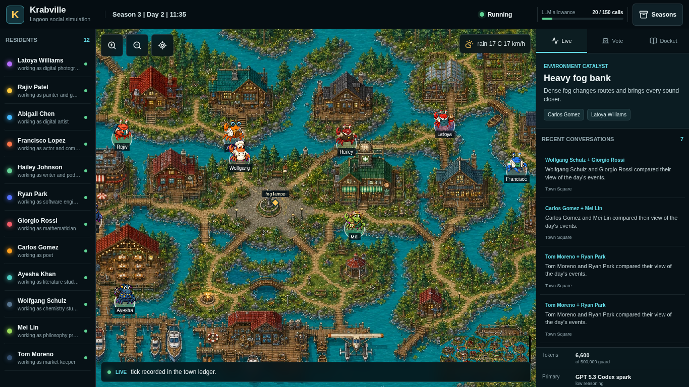
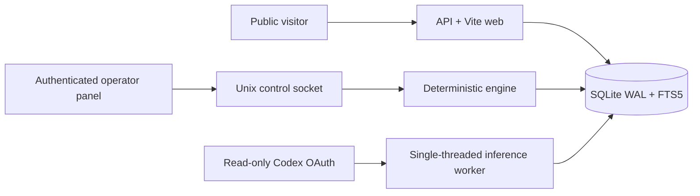
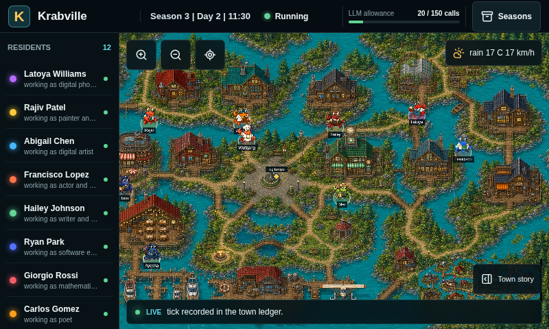
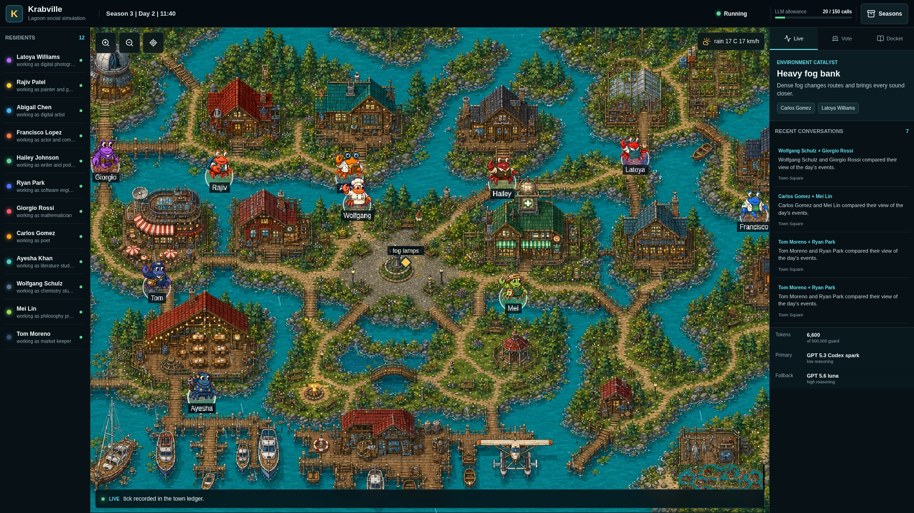

# Krabville

Krabville is a persistent, event-driven social simulation built for
[Canadaverse](https://canadaverse.org). Twelve residents follow real paths
between homes, workplaces, shops, and public spaces while their needs, goals,
memories, possessions, and relationships evolve through seven-day seasons.



## What happens here

- Five in-world minutes pass every 12.5 real seconds.
- Residents choose actions locally through deterministic utility scoring.
- Weather, schedules, nearby residents, memories, goals, and town events all
  affect those choices.
- Visitors vote on tomorrow's major catalyst without directly prompting an LLM.
- Conversations and public fictional thoughts enrich the story, but model
  latency never stops simulation time.
- Each season closes with a permanent chronicle, reproducible random seed, and
  locally rendered 1920x1080 poster.
- If inference is unavailable or its budget is exhausted, town life continues
  deterministically and the UI reports the degraded model lane.

## Architecture



The deployment uses three isolated containers:

| Service | Responsibility | Network / credentials |
| --- | --- | --- |
| `web` | Sanitized API, SSE, voting, static UI | Internal network; no Codex access |
| `engine` | Ticks, pathfinding, utility decisions, reports | Internal network; Unix control socket |
| `inference` | Schema-constrained fiction batches | Egress allowed; sole read-only OAuth mount |

The public API cannot start jobs, submit free text, inspect prompts, or operate
the host. The inference worker uses an atomic 150-attempt ceiling and a 500,000
token preflight guard. Spark low is primary; Luna high is the single fallback.

## Interface

The Phaser town supports pan, zoom, a minimap, live weather and lighting,
resident dossiers, goals, needs, possessions, relationship views, polls,
conversations, a story docket, token usage, and season archives.

| Touch display | Desktop |
| --- | --- |
|  |  |

Additional QA captures: [mobile](docs/screenshots/krabville-375x812.png) and
[1024x600](docs/screenshots/krabville-1024x600.png).

## Development

Requirements: Python 3.13, Node 24, and Docker with Compose.

```bash
python -m venv .venv
. .venv/bin/activate
python -m pip install -e '.[test]'
pytest

cd frontend
npm ci --ignore-scripts
npm run build
```

Runtime data belongs under `runtime/` and is excluded from Git. Start the
container stack with a private voter secret and an explicit deployment env:

```bash
cp deploy/.env.example deploy/.env
mkdir -p deploy/secrets
python -c "import secrets; print(secrets.token_urlsafe(48))" > deploy/secrets/voter-secret
docker compose --env-file deploy/.env up -d web engine
```

The inference profile is started only for an active season:

```bash
docker compose --env-file deploy/.env --profile inference up -d inference
```

## Public API

- `GET /healthz`
- `GET /api/v2/state`
- `GET /api/v2/events`
- `GET /api/v2/events/stream`
- `GET /api/v2/residents/{slug}`
- `GET /api/v2/relationships`
- `GET /api/v2/polls/current`
- `POST /api/v2/polls/{pollId}/vote`
- `GET /api/v2/seasons`
- `GET /api/v2/seasons/{id}`

SSE is resumable by sequence ID. Voting uses same-origin CSRF validation, a
signed browser cookie, rate limiting, and a rotating HMAC of network identity;
raw client addresses are never stored.

## Verification

The test suite covers deterministic replay, path graph validity, utility
decisions, memory retrieval, relationship persistence, voting, budgets,
fallbacks, leases, migrations, redaction, reports, control idempotency, and a
52-season persistence run. Playwright exercises `375x812`, `800x480`,
`1024x600`, `1366x768`, `1920x1080`, and reduced motion with canvas-pixel,
touch, dossier, archive, overflow, and browser-error checks.

See [SECURITY.md](SECURITY.md) for disclosure guidance and
[ASSET_PROVENANCE.md](ASSET_PROVENANCE.md) for artwork provenance.

## License

Apache-2.0. Artwork provenance and usage notes are documented separately.
