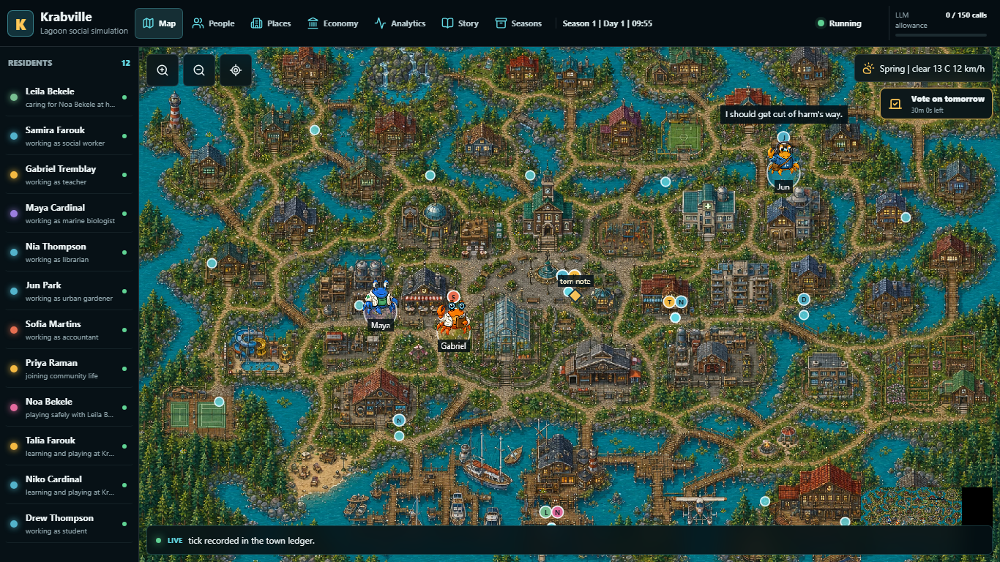
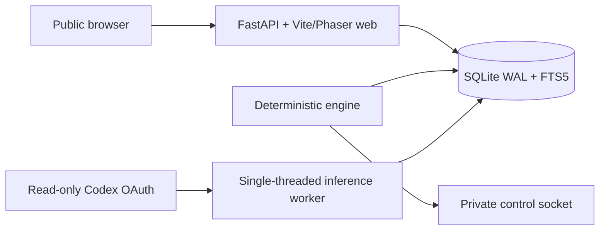
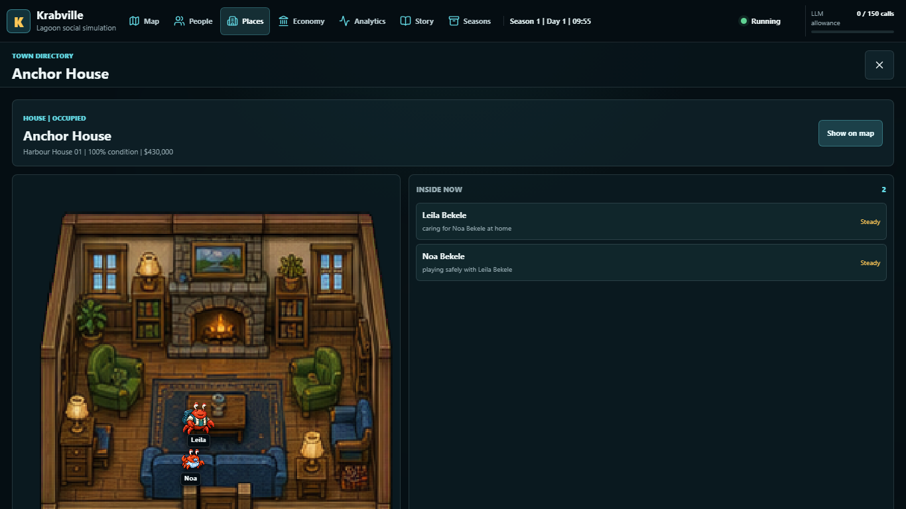
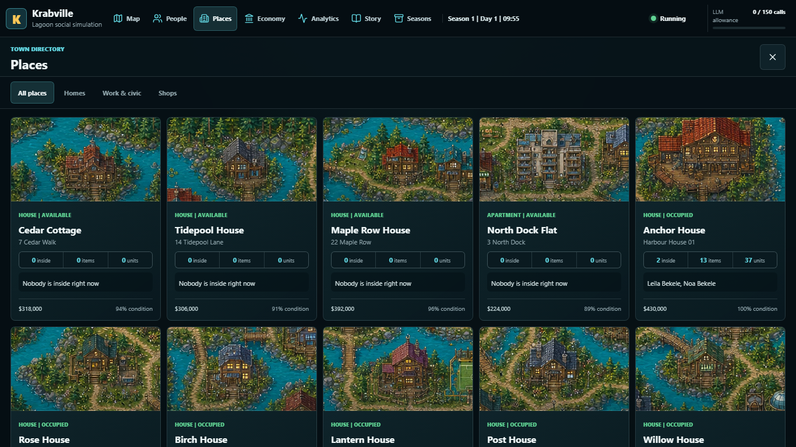
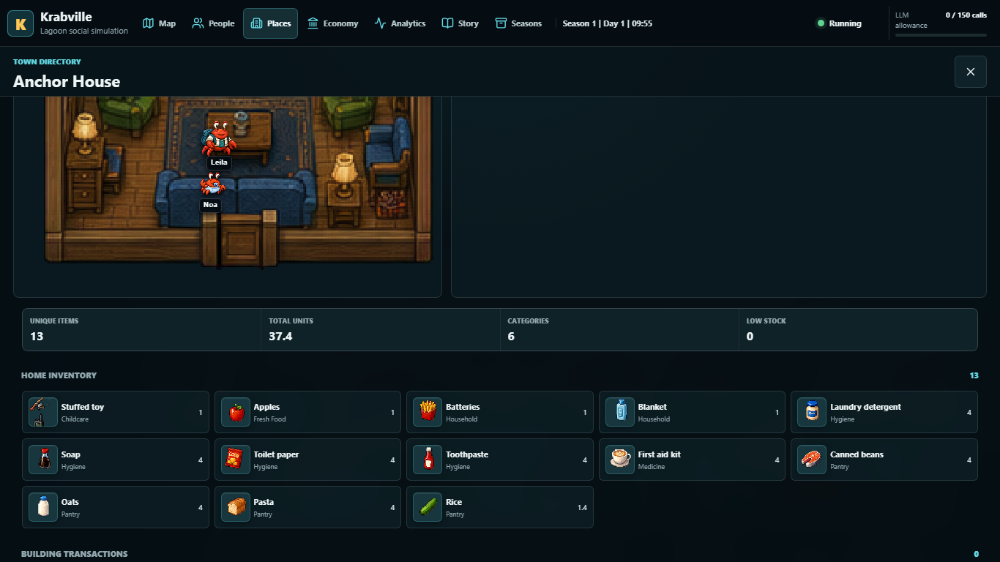
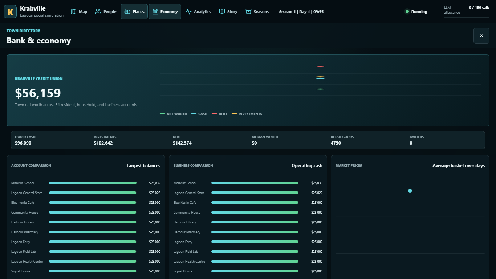
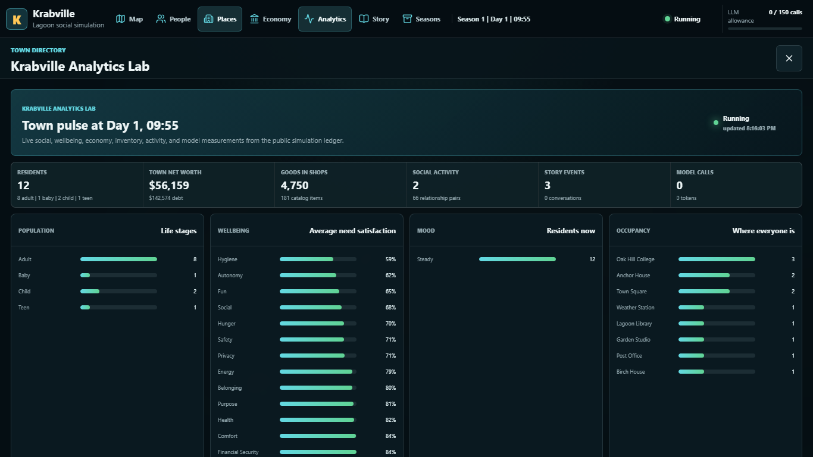
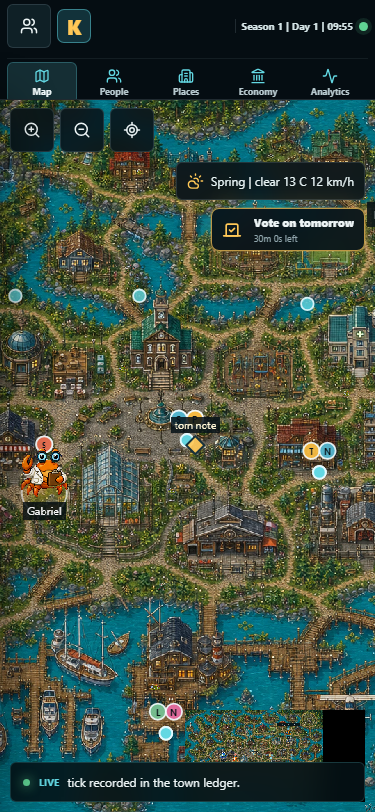

# Krabville KVsim v2

[](https://github.com/n30nex/Krabville/actions/workflows/ci.yml)
[](LICENSE)

Krabville is a persistent, event-driven social simulation built for
[Canadaverse](https://canadaverse.org). Residents follow roads between homes,
workplaces, schools, shops, and public spaces while their needs, families,
finances, goals, memories, beliefs, and relationships shape what happens next.



## A Season At A Glance

| Rule | KVsim v2 behavior |
| --- | --- |
| World clock | Five in-world minutes every 12.5 real seconds |
| Season length | Seven in-world days over seven real hours |
| Campaign | Start Season 1 once, then continue automatically through Season 20 |
| Intermission | Ten real minutes between completed seasons |
| Initial residents | Eight adults, one baby, two children, and one teen |
| Population limits | 32 living residents, including at most 24 adults and seniors |
| Season close | Chronicle, revealed random seed, statistics, and a local 1920x1080 poster |
| Final stop | Season 20 completes, model work locks, and inference exits |

Simulation time never waits for an LLM. Local utility scoring selects actions
from schedules, needs, mood, weather, goals, memories, relationships, nearby
residents, and active events. Model-generated dialogue and reflections enrich
the story asynchronously; deterministic behavior keeps the town alive if the
model lane is delayed or unavailable.

## What Shapes A Life

- **Needs and mood:** energy, hunger, hygiene, health, comfort, safety, fun,
  social connection, belonging, privacy, purpose, autonomy, and financial
  security all influence choices. Residents visibly ponder likely actions
  before committing to one.
- **Families and care:** households share homes, children require caregivers,
  parents can take leave, and households can pay for care. Traits and visual
  characteristics can pass to children.
- **Lifecycle:** residents progress through baby, child, teen, adult, and senior
  stages. Adult life lasts four seasons and senior life lasts two. Minors are
  protected from mortality; rare non-graphic adult mortality can occur.
- **Economy:** wages, cash, bank balances, investments, expenses, property,
  childcare, debt, and interest settle once per day at 04:00 in-world time
  through balanced ledger entries.
- **Relationships and drama:** affinity, trust, familiarity, and tension evolve
  through friendship, romance, jealousy, gossip, rivalry, betrayal, illness,
  accidents, breakups, marriage, children, adoption, and inheritance. Content
  stays within a TV-14 boundary.
- **Goals and memory:** residents pursue life goals, daily wants, hobbies, and
  work while searchable memories, beliefs, secrets, and possessions carry
  consequences into later seasons.
- **Public voting:** one bounded poll opens each day. Visitors choose among
  environmental, community, economic, social, weather, and strange catalysts;
  the winner becomes the following day's major event.

## Architecture



The production stack uses three isolated containers:

| Service | Responsibility | Trust boundary |
| --- | --- | --- |
| `web` | Static UI, sanitized API, resumable SSE, and voting | No Codex credentials or host controls |
| `engine` | Clock, utility decisions, pathfinding, economy, lifecycle, events, and reports | Private control socket; no model credentials |
| `inference` | Schema-constrained dialogue, intentions, reflections, and chronicles | Sole read-only OAuth mount and bounded egress |

The engine publishes a commitment to each 256-bit season seed, then reveals the
seed after completion so deterministic events can be replayed and audited.

## Model Lane

Structured fiction jobs use **GPT-5.3 Codex Spark at low reasoning** first and
**GPT-5.6 Luna at low reasoning** after one failed Spark attempt. The worker is
single-threaded, invokes no tools, and cannot block world ticks. An attempt is
reserved atomically before launch, including failed or interrupted calls.

Each season has a hard ceiling of 150 attempts and a 1,500,000-token preflight
guard. When the allowance is exhausted, the public UI shows a degraded model
lane and the deterministic simulation continues. No completed season can queue
new model work, and the inference worker makes no calls after Season 20 locks.

## Public Interface

The desktop and mobile UI provides a pannable and zoomable town, minimap,
four-season animated weather and day/night lighting, 25 uniquely mapped live
interiors with moving resident sprites, exterior place cards, RPG-style goods
inventories, resident dossiers, needs, predicted actions, families, property,
finances, beliefs, relationship graphs, conversations, map-native voting,
story ledgers, a comprehensive Analytics Lab, model usage, and season archives.

### Feature Tour

| Live interiors | Building directory |
| --- | --- |
|  |  |

| RPG inventories | Simulated economy |
| --- | --- |
|  |  |

| Analytics Lab | Mobile world view |
| --- | --- |
|  |  |

Additional QA captures are available at
[800x480](docs/screenshots/krabville-800x480.png),
[1024x600](docs/screenshots/krabville-1024x600.png), and
[1366x768](docs/screenshots/krabville-1366x768.png).

### Public Safety

Public simulation data is read-only. The only public mutation is the narrow
`choiceId` vote endpoint; visitors cannot submit free text, prompt residents,
start or stop seasons, operate services, or inspect model jobs. Voting uses
same-origin CSRF validation, a signed browser cookie, rate limiting, and a
rotating HMAC identity. Raw network addresses are not stored.

Prompts, provider replies, hidden reasoning, commands, OAuth data, credentials,
and private operational details are never serialized by the public API.

## API

`/api/v3` is the KVsim v2 public contract:

- `GET /api/v3/state`
- `GET /api/v3/events`
- `GET /api/v3/events/stream`
- `GET /api/v3/residents/{slug}`
- `GET /api/v3/relationships`
- `GET /api/v3/polls/current`
- `POST /api/v3/polls/{pollId}/vote`
- `GET /api/v3/seasons`
- `GET /api/v3/seasons/{id}`

The equivalent `/api/v2/*` routes remain available as compatibility aliases
during rollout. `/api/krabville/state` remains a temporary legacy state
adapter. SSE clients can resume from their last sequence ID.

## Local Development

Requirements: Python 3.13, Node.js with npm, and Docker with Compose for the
container workflow.

Install the Python package and build the frontend:

```bash
python -m venv .venv
. .venv/bin/activate
python -m pip install -e '.[test]'

cd frontend
npm ci --ignore-scripts
npm run build
cd ..
```

Initialize a local database, start Season 1, and run the services in separate
terminals:

```bash
krabville-manage init
krabville-manage start
krabville-engine
krabville-api
krabville-inference
```

The inference worker uses its deterministic fake provider by default. Runtime
state is written to `runtime/`, which is excluded from Git. Useful local
operator commands include:

```bash
krabville-manage diagnose
krabville-manage tick --count 12
krabville-manage run-fake-season --days 7
krabville-manage report
```

Run verification:

```bash
pytest
cd frontend
npm run build
npm run test:e2e
```

## Container Deployment

Create a deployment environment from the template and generate a private voter
secret. Set deployment-specific data, Codex binary, and read-only OAuth mount
locations only in the untracked `deploy/.env` file.

```bash
cp deploy/.env.example deploy/.env
mkdir -p deploy/secrets
python -c "import secrets; print(secrets.token_urlsafe(48))" > deploy/secrets/voter-secret

docker compose --env-file deploy/.env build --pull
docker compose -f compose.yaml -f compose.selfhost.yaml --env-file deploy/.env up -d web engine
docker compose -f compose.yaml -f compose.selfhost.yaml --env-file deploy/.env --profile inference up -d inference
docker compose -f compose.yaml -f compose.selfhost.yaml --env-file deploy/.env ps
```

For a portable loopback-only deployment, include `compose.selfhost.yaml` in
each command. The full clean-install, Codex device-login, reverse-proxy, and
first-season walkthrough is in [Self-hosting KVsim v2](docs/SELF_HOSTING.md).
Upgrade, backup, health, and rollback procedures are in
[Operations](docs/OPERATIONS.md).

Keep `KRABVILLE_FAKE_PROVIDER=true` for tests and accelerated soaks. A live
operator-managed deployment explicitly sets it to `false` only after the
read-only model credential mount is prepared. Do not commit `deploy/.env`,
runtime databases, reports, secrets, or provider state.

## Verification Scope

The suite covers deterministic replay, needs and action selection, population
and inheritance, childcare, balanced economy ledgers, lifecycle transitions,
path validity, relationship consequences, voting, CSRF, rate limits, model
budgets and fallback, leases, migrations, redaction, report rendering, and
multi-season persistence. Playwright covers mobile and desktop viewports,
canvas pixels, pan/zoom, dossiers, archives, reduced motion, stale state, and
browser errors.

Artwork was generated specifically for this project with OpenAI ImageGen 2,
then normalized locally for deterministic runtime use. See
[ASSET_PROVENANCE.md](ASSET_PROVENANCE.md) for source-to-production hashes and
[SECURITY.md](SECURITY.md) for disclosure guidance.

## License

Apache-2.0. Included artwork is documented separately in the asset provenance
ledger.
